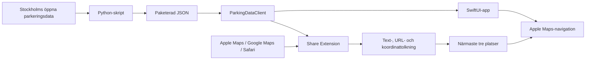
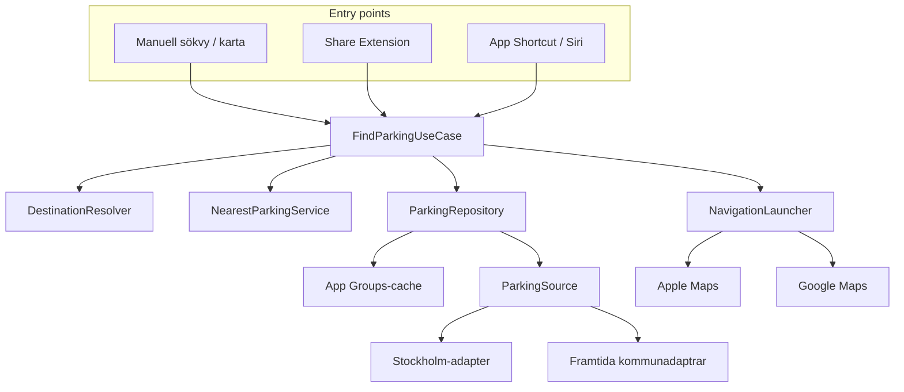

# Arkitektur

Det här dokumentet skiljer på nuvarande implementation och önskad målarkitektur. Skillnaden är avsiktlig: repot ska visa både fungerande MVP och varför nästa refaktorering behövs.

## Nuvarande implementation

`ParkingDataClient` läser det lokala datasetet och sorterar parkeringar efter CoreLocations raka avstånd. Huvudappen använder aktuell position. Share Extension tar emot delad data, försöker hitta koordinat eller adress, använder MapKit-sökning vid behov och visar tre kandidater.

MVP:n är avsiktligt enkel, men Share Extension innehåller i dag flera ansvar: inläsning, formatdetektering, URL-tolkning, geosökning, närhetslogik, UI och navigering. Det gör automatiska tester och återanvändning svårare.

## Målarkitektur

## Föreslagna ansvar

| Komponent | Ansvar |
| --- | --- |
| `FindParkingUseCase` | Orkestrerar destination, data och rangordning för alla entry points |
| `DestinationResolver` | Gör kartobjekt, text, URL eller sökfras till en koordinat |
| `ParkingRepository` | Ger en enhetlig lista och döljer cache och datakälla |
| `ParkingSource` | Adaptergränssnitt för Stockholm och framtida kommuner |
| `NearestParkingService` | Rangordnar kandidater med en utbytbar avståndsstrategi |
| `NavigationLauncher` | Öppnar vald kandidat i användarens navigeringsapp |

## Gemensam datamodell

Den nuvarande modellen innehåller id, koordinat, adress, avgift och övrig information. För flera datakällor bör modellen även kunna bära:

- källans identifierare och namn
- parkeringstyp
- senast uppdaterad
- licens eller datalänk
- förtroendegrad eller kvalitetsstatus

## Avvägningar

- Rak linje är snabb och begriplig för MVP, men motsvarar inte alltid kör- eller gångavstånd.
- Paketerad JSON gör appen snabb och oberoende av API-drift, men data blir inte automatiskt aktuell.
- Share Extension ger ett naturligt användarflöde, men har begränsad livstid och varierande indata från andra appar.
- App Groups möjliggör delad cache, men introducerar signing- och entitlement-konfiguration som måste testas i Xcode Cloud och på fysisk enhet.
