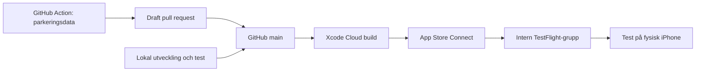

# CI/CD och releaseansvar

Projektets releaseflöde är byggt för att källkoden ska kunna vara öppen samtidigt som Apple-konton, signering och publicering förblir under projektägarens kontroll.

## Nuvarande flöde

Appen har byggts utan lokal `.env`, skickats genom Xcode Cloud och installerats via en intern TestFlight-grupp. Parkeringsnyckeln finns som ett avgränsat GitHub Actions-secret och är inte en del av appbygget.

## Automatiserad parkeringsdata

Ett separat workflow hämtar Stockholms MC-parkeringsdata varje vecka eller när maintainern startar det manuellt. Flödet kör tester och validering, uppdaterar endast den publika JSON-filen och öppnar en draft pull request.

Det automatiska flödet kan alltså föreslå en ändring men inte publicera appen. Maintainern granskar och slår ihop dataändringen, varefter den vanliga build- och releasekedjan tar vid.

## Två separata spår

### Bidragsspåret

1. Bidragsgivaren skapar en fork eller branch.
2. Ändringen byggs och testas lokalt.
3. En pull request beskriver lösning, verifiering och eventuell AI-användning.
4. Projektägaren granskar och slår ihop godkända bidrag.

Detta spår kräver inte App Store Connect, distributionscertifikat eller projektägarens Apple Developer-konto.

### Releasespåret

1. Projektägaren väljer vilka ändringar som ska ingå.
2. Version och unikt buildnummer kontrolleras.
3. Release-konfigurationen byggs via Xcode Cloud.
4. Bygget behandlas i App Store Connect.
5. Projektägaren kopplar rätt build till intern eller extern TestFlight-grupp.
6. Kritiska flöden verifieras på fysisk enhet.
7. Projektägaren beslutar separat om App Store-publicering.

## Hemligheter och signering

| Information | Hantering |
| --- | --- |
| Parkerings-API-nyckel | GitHub Actions repository secret, endast tillgänglig för uppdateringsworkflow |
| Apple-inloggning | Hanteras utanför repot av projektägaren |
| Certifikat och privata nycklar | Delas inte och checkas aldrig in |
| Provisioning och distribution | Automatisk signing/Xcode Cloud under projektägarens kontroll |
| Parkeringsdata | Publik, optimerad JSON får ingå i appen |

En pull request ska aldrig kräva en produktionshemlighet för att kunna granskas.

## Releasechecklista

- [ ] Godkända ändringar finns på avsedd commit.
- [ ] Huvudapp och Share Extension bygger i Release-konfiguration.
- [ ] Appen bygger utan `.env`, API-nyckel och andra lokala utvecklingsfiler.
- [ ] Version och buildnummer är korrekta och buildnumret är unikt.
- [ ] Behörigheter, signing, bundle identifiers och extension-konfiguration är kontrollerade.
- [ ] Kartan, platsbehörighet, närmaste-sökning och Apple Maps-navigation fungerar.
- [ ] Relevanta Share Extension-flöden är testade på fysisk iPhone.
- [ ] Diagnostik innehåller inte hemligheter eller känsliga destinationer.
- [ ] TestFlight-noteringar beskriver vad testaren ska fokusera på.
- [ ] Resultat och kända begränsningar dokumenteras i `Logg.md`.

## Nästa förbättringar

- automatiska build- och testkontroller på pull requests
- ett riktigt unit test-target och ett litet stabilt testdataset
- automatiserad kontroll att förbjudna filer inte ingår i app-resurser
- metadata som visar datasetets aktualitet i appen
- tydligare versionsstrategi och release notes från sammanslagna ändringar
- en dokumenterad rutin för att stoppa eller ersätta en felaktig TestFlight-build

CI ska ge bevis på teknisk kvalitet. CD och publicering förblir ett uttryckligt mänskligt beslut.
